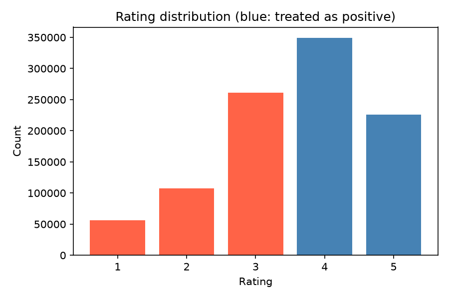
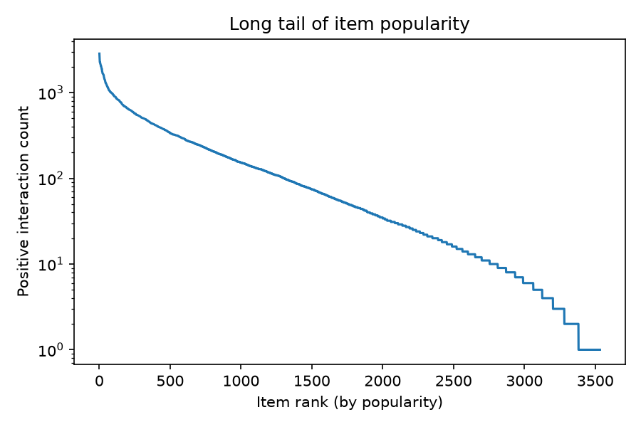
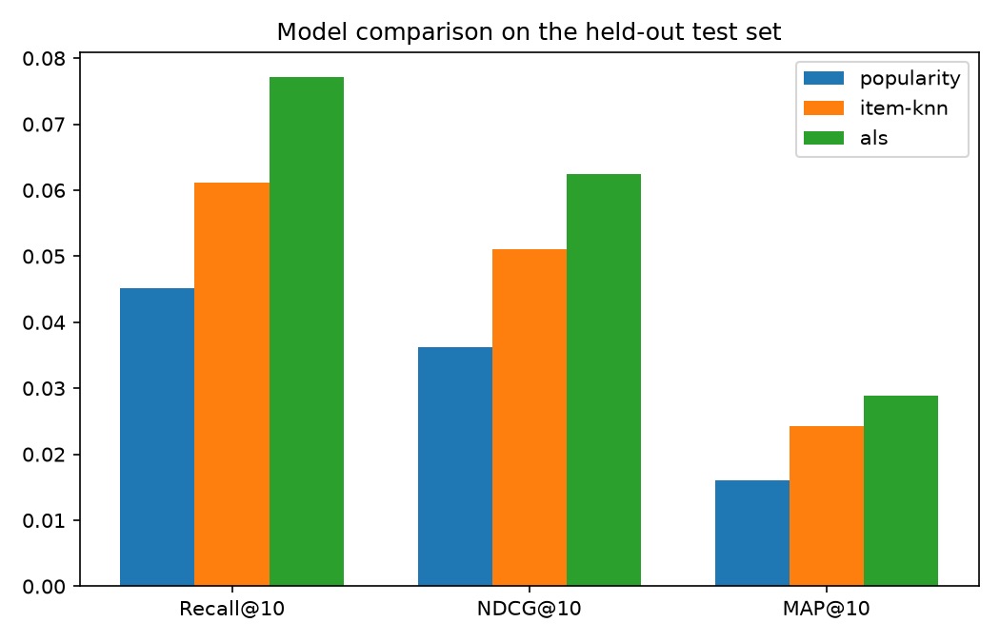

# MovieLens Recommender: Matrix Factorization from Scratch

Top-N movie recommendation on [MovieLens 1M](https://grouplens.org/datasets/movielens/1m/), built to show the math, not the library calls: implicit-feedback ALS (Hu, Koren & Volinsky, 2008) implemented from scratch in NumPy, benchmarked against a popularity baseline and item-item collaborative filtering, with a leakage-safe temporal split, bootstrap significance testing, and a Streamlit demo with per-recommendation explanations.

Stack: `pandas`, `numpy`, `scipy` (sparse containers + Cholesky solves only, no `implicit`, `lightfm` or `surprise`), `matplotlib`, `streamlit`.

## Why recommendations matter

Recommendation surfaces carry a large share of engagement wherever catalogs outgrow browsing (Netflix has attributed the large majority of hours streamed to its recommender: Gomez-Uribe & Hunt, 2015). The mechanism is the same one visible in this dataset's EDA: catalogs are long-tailed, attention is scarce, and users cannot browse thousands of movies, something has to rank them. A model that recovers a user's next positive interactions inside a 10-slot shelf is a direct proxy for that engagement.

## Task framing

**Implicit-feedback top-N recommendation.** Ratings of 4 or 5 are treated as positive interactions; everything else is unobserved, not negative, just unknown. Models rank the full catalog per user and are judged on their top 10.

**Temporal split, not random.** For each user with at least 15 positives, the chronologically last 5 positives are the test set and the 5 before those are the validation set (used only for hyperparameter tuning); everything earlier is train. Low-activity users stay train-only. A random split would put a user's future interactions into training while asking the model to predict their past, inflating offline metrics in exactly the way that never survives deployment. Splitting on each user's own timeline evaluates the question production actually asks: given everything this user liked so far, what will they like next?

## Models (`src/models/`), weakest to strongest

**1. Popularity**: everyone gets the most-interacted items they haven't seen. Non-personalised, near-free, and the mandatory benchmark; on head-heavy catalogs it is embarrassingly competitive, and any personalised model that can't beat it isn't paying for itself.

**2. Item-item CF** (`item_knn.py`): items are binary vectors over users; cosine similarity between those vectors, truncated to the top-100 neighbours per item, gives a sparse similarity matrix `S`. A user's score for item *j* is the sum of similarities between *j* and their history, which makes every recommendation decomposable into the neighbours that drove it (the demo app's "why" panel).

**3. ALS matrix factorization** (`als.py`): from-scratch NumPy implementation of implicit-feedback alternating least squares, derived below.

## ALS: the math

Every user gets a factor vector $x_u \in \mathbb{R}^f$, every item $y_i \in \mathbb{R}^f$. Observed positives get preference $p_{ui}=1$, everything else $p_{ui}=0$, and each term is weighted by a confidence

```math
c_{ui} = 1 + \alpha r_{ui}
```

where $r_{ui}$ is the raw rating of the positive interaction (a 5-star event carries more confidence than a 4-star one) and $r_{ui}=0$ when unobserved, so unobserved pairs participate at low confidence $c_{ui}=1$. The objective, summed over all $U \times I$ pairs:

```math
L = \sum_{u,i} c_{ui} \big(p_{ui} - x_u^\top y_i\big)^2 + \lambda \left(\sum_u \Vert x_u \Vert^2 + \sum_i \Vert y_i \Vert^2\right)
```

**Closed-form update.** Fix the item factors $Y \in \mathbb{R}^{I \times f}$ and solve for one user. With $C^u = \mathrm{diag}(c_{u1},\dots,c_{uI})$ and $p_u$ the user's preference vector:

```math
\frac{\partial L}{\partial x_u} = -2 Y^\top C^u \big(p_u - Y x_u\big) + 2\lambda x_u = 0
```

```math
x_u = \big(Y^\top C^u Y + \lambda I\big)^{-1} Y^\top C^u p_u
```

and symmetrically $y_i = (X^\top C^i X + \lambda I)^{-1} X^\top C^i p_i$ for items.

**The efficiency trick.** Computing $Y^\top C^u Y$ naively costs $O(I f^2)$ per user, hopeless. But $C^u = I + (C^u - I)$, and $(C^u - I)$ is non-zero only on the $n_u$ items the user actually touched, so

```math
Y^\top C^u Y = Y^\top Y + Y^\top (C^u - I) Y
```

where $Y^\top Y$ is shared by all users and only needs computing once per sweep, and the second term only involves the $n_u$ rows the user actually touched. Similarly

```math
Y^\top C^u p_u = \sum_{i \in \mathcal{I}_u} (1 + \alpha r_{ui}) y_i
```

Each user then costs $O(n_u f^2 + f^3)$, giving $O(f^2 N + f^3 U)$ per sweep for $N$ total interactions. Each $f \times f$ system is symmetric positive definite (for $\lambda > 0$), so `src/models/als.py` solves it with a Cholesky factorisation. That is the whole algorithm.

## Results

Real [MovieLens 1M](https://grouplens.org/datasets/movielens/1m/) data (1,000,209 ratings, 6,040 users, 3,883 movies). Test protocol: each user's last 5 positives, models trained on train+validation, 5,656 evaluated users, a 3,533-item catalog. ALS hyperparameters were selected on the validation slice (see below): factors=64, lambda=0.1, alpha=1.0, 15 iterations.

| Model | Recall@10 | NDCG@10 | MAP@10 | Coverage@10 | Mean pop. rank |
|---|---|---|---|---|---|
| popularity | 0.0452 | 0.0362 | 0.0161 | 3.3% | 11 |
| item-knn (k=100) | 0.0611 | 0.0511 | 0.0242 | 9.0% | 34 |
| **ALS (ours)** | **0.0771** | **0.0625** | **0.0289** | **31.5%** | 183 |

**Is ALS actually better than item-knn, or just luckier?** Bootstrap over users (1,000 resamples) on the per-user Recall@10 difference: **+0.0159, 95% CI [+0.0125, +0.0195]**. The interval excludes zero, so the improvement is statistically significant on this split, not just numerically bigger.

**Accuracy isn't the only axis.** Coverage@10 is the share of the catalog appearing in at least one user's top-10; mean pop. rank is the average popularity rank of recommended items (1 = most popular). The popularity baseline pins itself to the head by construction (mean rank 11, out of 3,533 items). Item-knn drifts toward the head too (mean rank 34): cosine neighbourhoods of popular items are other popular items. ALS reaches much further into the tail (31.5% coverage, mean rank 183) while also winning on accuracy: it spends its capacity personalising rather than re-serving blockbusters. In a production setting that difference compounds, head-only recommenders create feedback loops that starve the tail of the catalog.

### Hyperparameter sensitivity (validation slice)

Grid varies one hyperparameter at a time; full table in [`reports/hyperparam_sensitivity.md`](reports/hyperparam_sensitivity.md).

| | 16 | 32 | 64 |
|---|---|---|---|
| **factors** (reg=0.1, alpha=1.0) | 0.0802 | 0.0846 | **0.0876** |

| | reg=0.01 | reg=0.1 | reg=1.0 |
|---|---|---|---|
| **regularisation** (f=64, alpha=1.0) | **0.0879** | 0.0876 | 0.0872 |

| | alpha=1.0 | alpha=5 | alpha=40 |
|---|---|---|---|
| **confidence** (f=64, reg=0.1) | **0.0876** | 0.0794 | 0.0571 |

Validation Recall@10 shown. Recall improved as `factors` went up across the whole range tried, and dropped off monotonically as `alpha` (confidence scaling) went up, unusual for this dataset compared to the more moderate mid-range optimum a purely synthetic benchmark tends to produce, this real data rewards a gentler confidence weighting than the Hu et al. paper's own examples suggest. Regularisation barely moved the needle in comparison.

## EDA





The rating distribution motivates the >= 4 positive threshold; the long-tail plot explains both why the popularity baseline is competitive and why coverage is reported alongside accuracy. Narrative walkthrough in [`notebooks/01_eda.ipynb`](notebooks/01_eda.ipynb), model walkthrough in [`notebooks/02_modeling.ipynb`](notebooks/02_modeling.ipynb).



## Limitations

Offline ranking metrics are a proxy, not the target: Recall@10 on a static snapshot does not equal online CTR or retention, and only an A/B test settles that. Cold start is unhandled: users and items without training interactions get no personalised scores (ALS returns zero vectors; item-knn has no neighbours). The dataset is a static historical snapshot, so there is no recency decay, no session structure, and popularity feedback loops are invisible. The >=4 binarisation discards genuine negative signal (a 1-star rating is information, not absence). Hyperparameters were tuned on a single validation slice rather than cross-validated splits.

## Repository structure

```
movielens-recommender/
├── data/raw/  data/processed/        # gitignored; real MovieLens 1M is downloaded on demand
├── notebooks/
│   ├── 01_eda.ipynb                  # narrative EDA
│   └── 02_modeling.ipynb             # narrative modeling walkthrough
├── src/
│   ├── config.py                     # paths, constants, hyperparameters
│   ├── data_ingestion.py             # download real data, with a synthetic fallback
│   ├── split.py                      # temporal per-user train/val/test
│   ├── eda.py                        # figures + summary stats
│   ├── evaluate.py                   # metrics, tuning grid, bootstrap CI
│   └── models/
│       ├── popularity.py
│       ├── item_knn.py
│       └── als.py                    # from-scratch implicit ALS
├── reports/                          # committed: results.md, CSVs, figures
├── tests/                            # unit tests for the split, models and metrics
├── app.py                            # Streamlit demo
└── requirements.txt
```

## How to run

```bash
python -m venv .venv && source .venv/bin/activate
pip install -r requirements.txt

python -m src.data_ingestion     # downloads ml-1m.zip -> data/raw/ (falls back to synthetic data if blocked)
python -m src.split              # temporal per-user split -> data/processed/
python -m src.eda                # figures -> reports/figures/
python -m src.evaluate tune      # ALS grid on validation -> reports/hyperparam_sensitivity.md
python -m src.evaluate test      # final metrics + bootstrap CI -> reports/results.md
streamlit run app.py             # demo: history vs top-10 per model, plus the "why" panel
```

The full pipeline (ingestion through the final test evaluation) takes a few minutes on a laptop CPU. If `files.grouplens.org` is unreachable, ingestion falls back to a schema-identical synthetic dataset and stamps every downstream report with a warning; rerun ingestion with network access to get real numbers.

## Tests

```bash
pytest
```

23 tests covering the temporal split (no leakage, correct per-user counts), both baseline models, the ranking metrics (hand-computed NDCG/MAP cases), the synthetic data generator, and ALS itself (it recovers a known low-rank structure well above random chance, confidence scaling measurably changes the fit, and a user with no history gets zero factors rather than garbage).

## References

Y. Hu, Y. Koren, C. Volinsky. *Collaborative Filtering for Implicit Feedback Datasets.* ICDM 2008.
F. M. Harper, J. A. Konstan. *The MovieLens Datasets: History and Context.* ACM TiiS 5(4), 2015.
C. A. Gomez-Uribe, N. Hunt. *The Netflix Recommender System: Algorithms, Business Value, and Innovation.* ACM TMIS 6(4), 2015.
